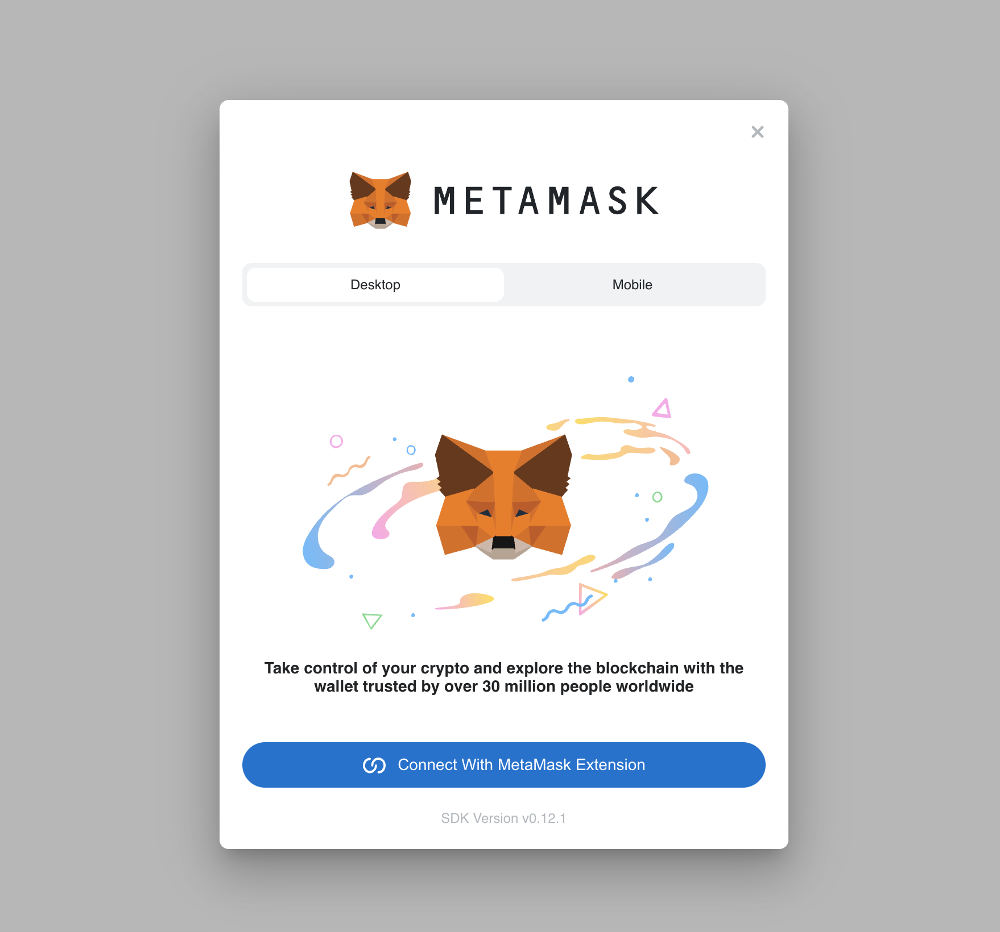

# XMTP PWA with MetamaskSDK Tutorial



### Installation

```bash
bun install
bun start
```

This tutorial will guide you through the process of creating an XMTP app with MetamaskSDK.

### Setup

For MetamaskSDK SDK to work as a fresh install you need to install this packages

```bash
bun install @metamask/sdk-react ethers@^5
```

### Setting up the MetaMask Provider

Wrap your application with the MetaMaskProvider from `@metamask/sdk-react`.

```jsx
import { useEffect, useState } from "react";
import { MetaMaskProvider } from "@metamask/sdk-react";
import Page from "./Page";

export default function App() {
  const [ready, setReady] = useState(false);

  useEffect(() => {
    setReady(true);
  }, []);
  return (
    <>
      {ready ? (
        <MetaMaskProvider
          debug={false}
          sdkOptions={{
            checkInstallationImmediately: false,
            dappMetadata: {
              name: "Demo React App",
              url: window.location.host,
            },
          }}
        >
          <Page />
        </MetaMaskProvider>
      ) : null}
    </>
  );
}
```

### MetaMask Connection

Use the `useSDK` hook from `@metamask/sdk-react` to manage MetaMask connections.

```jsx
import React, { useState } from 'react';
import { useSDK } from '@metamask/sdk-react';

export const App = () => {
  const [account, setAccount] = useState<string>();
  const { sdk, connected, connecting, provider, chainId } = useSDK();

  // Function to connect to the SDK
  const connect = async () => {
    try {
      // Attempt to connect to the SDK
      const accounts = await sdk?.connect();
      // Create a new Web3 provider
      const web3Provider = new ethers.providers.Web3Provider(window.ethereum);
      // Get the signer from the provider
      const signer = await web3Provider.getSigner();
      // Set the account and signer state
      setAccount(accounts?.[0]);
      //The signer is what we are going to use for XMTP later
      setSigner(signer);
    } catch (err) {
      // Log any errors that occur during connection
      console.warn(`failed to connect..`, err);
    }
  };

};
```

Use the XMTP client in your components:

```jsx
import { useClient } from "@xmtp/react-sdk";

// Example usage
const { client, error, isLoading, initialize } = useClient();
// Initialize with signer obtained from MetaMask
await initialize({ signer });
```

### Message Handling

In your `MessageContainer` component, use the `useMessages` and `useSendMessage` hooks from `@xmtp/react-sdk` to get the messages and send messages.

```jsx
const { messages, isLoading } = useMessages(conversation);
const { sendMessage } = useSendMessage();
```

### Conversation Handling

In your ListConversations component, use the useConversations and useStreamConversations hooks from @xmtp/react-sdk to get the conversations and stream new conversations.

```jsx
const { conversations } = useConversations();
const { error } = useStreamConversations(onConversation);
```

That's it! You've now created an XMTP app with MetamaskSDK.

- [Metamask Documentation](https://docs.metamask.io/wallet/how-to/connect/set-up-sdk/javascript/react/)
